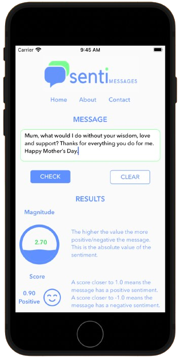
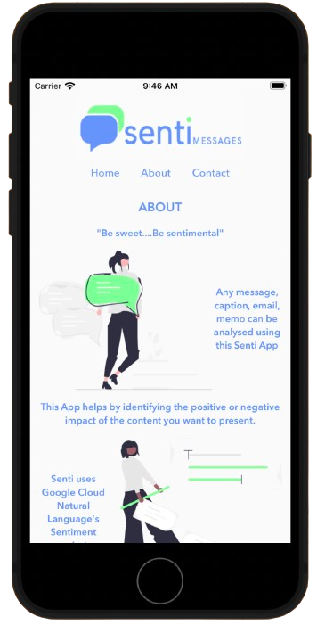
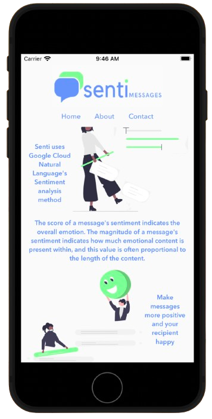
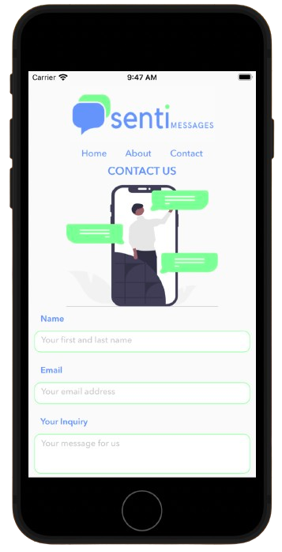
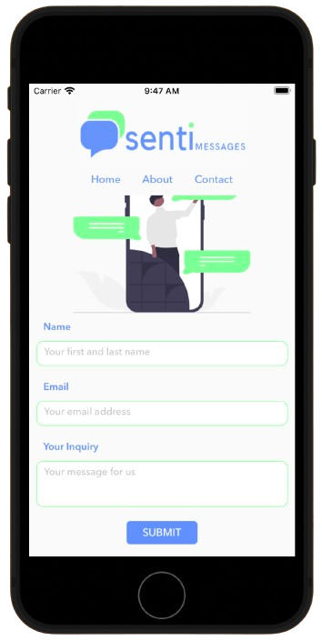

#  Senti Messages

## App Overview

This App helps by identifying the positive or negative impact of the content you want to present. Any message, caption, email, memo can be analysed using this Senti App.

Senti uses Google Cloud Natural Language's Sentiment analysis method. The score of a message's sentiment indicates the overall emotion. The magnitude of a message's sentiment indicates how much emotional content is present within, and this value is often proportional to the length of the content.

Make messages more positive and your recipient happy.

## App Screenshots
<p float="left">



</p>
<p float="left">


</p>

## Demo
[ (https://vimeo.com/897224471)


# Getting Started

This is a new [**React Native**](https://reactnative.dev) project, bootstrapped using [`@react-native-community/cli`](https://github.com/react-native-community/cli).

>**Note**: Make sure you have completed the [React Native - Environment Setup](https://reactnative.dev/docs/environment-setup) instructions till "Creating a new application" step, before proceeding.

## Dependencies
* npm, react, react-native, react-router-native, react-native-reanimated.
* react-native-splash-screen, react-native-svg, react-native-text-size.
* d3, axios, @shopify/react-native-skia, @rneui/themed.

## Step 1: Start the Metro Server

First, you will need to start **Metro**, the JavaScript _bundler_ that ships _with_ React Native.

To start Metro, run the following command from the _root_ of your React Native project:

```bash
# using npm
npm start

# OR using Yarn
yarn start
```

## Step 2: Start your Application

Let Metro Bundler run in its _own_ terminal. Open a _new_ terminal from the _root_ of your React Native project. Run the following command to start your _Android_ or _iOS_ app:

### For Android

```bash
# using npm
npm run android

# OR using Yarn
yarn android
```

### For iOS

```bash
# using npm
npm run ios

# OR using Yarn
yarn ios
```

If everything is set up _correctly_, you should see your new app running in your _Android Emulator_ or _iOS Simulator_ shortly provided you have set up your emulator/simulator correctly.

This is one way to run your app — you can also run it directly from within Android Studio and Xcode respectively.

## Help

Any advise or help regarding issues, you can contact: harshvshah.22@gmail.com

## Authors

Contributors names and contact info:
* Harsh Shah [@_AIARXR](https://twitter.com/_AIARXR)

## License

This project is licensed under the MIT License.

## Version History! :tada:

* 0.1
    * Initial Release

# Troubleshooting

If you can't get this to work, see the [Troubleshooting](https://reactnative.dev/docs/troubleshooting) page.

# Learn More

To learn more about React Native, take a look at the following resources:

- [React Native Website](https://reactnative.dev) - learn more about React Native.
- [Getting Started](https://reactnative.dev/docs/environment-setup) - an **overview** of React Native and how setup your environment.
- [Learn the Basics](https://reactnative.dev/docs/getting-started) - a **guided tour** of the React Native **basics**.
- [Blog](https://reactnative.dev/blog) - read the latest official React Native **Blog** posts.
- [`@facebook/react-native`](https://github.com/facebook/react-native) - the Open Source; GitHub **repository** for React Native.

## Acknowledgments

* Inspiration: my pair-programming project with Arvin Josol